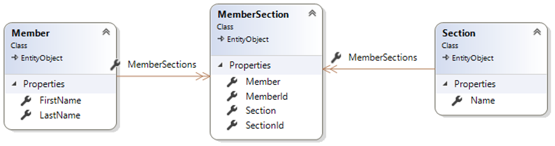

# Club Administration

## Lehrziele

* ASP.NET Core Razor Pages
* ASP.NET Core WebApi
* Entity Framework Core
* Unit of Work / Repositories
* Validierung

Es ist eine einfache Mitgliederverwaltung für einen Verein mit mehreren Sektionen zu erstellen. Ein Mitglied (`Member`) kann in mehreren Sektionen (`Section`) angemeldet sein. Die Zuordnung wird über die assoziative Entität `MemberSection` verwaltet.

## Core

Die Entitätsklassen sind bereits angelegt. Auch die Annotationen zur Definition (inkl. der Migrationen) der Datenbank sind bereits implementiert.

Im Corelayer sind die Contracts für die Repositories bedarfsgerecht zu erweitern.

## Import / Persistence

Es werden die 22 Mitglieder mit ihren 41 Mitgliedschaften in 6 Sektionen aus der Datei `members.csv` importiert.

Die Migration wurde bereits angelegt und muss nur verwendet werden, wenn an den Entitätsklassen Änderungen vorgenommen werden:

* Persistence als StartupProject 
* `Add-Migration InitialMigration`
* `UpdateDatabase` mit Kontrolle, ob DB angelegt wurde
* Die Daten über die `ImportConsole` importieren.

Die `ConnectionStrings` wurden in den relevanten Projekten schon in der `appSettings.json` festgelegt.

Die Repositories müssen noch mit den fehlenden Methoden erweitert werden.

## ASP.NET Core Razor Pages (ClubAdministration.Web)

Ergänzen Sie das Template um die entsprechenden Pages.

### Page "Index"

**Anforderungen**

1.	Auswahl der Sektion über Select-Tag
    1. Absenden des Formulars direkt nach der Auswahl (Spezialistenaufgabe) oder alternativ über einen Submit-Button
2.	Tabelle der Sektionsmitglieder
3.	Spalten der Tabelle
    1. Mitgliedername
    1. Anzahl der Sektionen, in denen die Person Mitglied ist
    1. Link zu Bearbeitungsseite des Mitgliedes mit der Id als Querystring-Parameter
4.	Sortierung der Tabelle nach Anzahl der Mitgliedschaften (absteigend)

### Page "Members/Edit"

**Anforderungen**

* Die `Id` des Mitglieds ist per Querystring-Parameter zu übergeben.
* Der Vor-/Nachname kann auf dieser Seite bearbeiten werden.

Folgende Randbedingungen sind dabei zu beachten:

* Sowohl FirstName als auch LastName dürfen nicht leer sein
* FirstName und LastName müssen aus zumindest zwei Zeichen bestehen
* Spezialistenaufgabe:
    * Es darf der geänderte Name nicht mit bereits in der Datenbank befindlichen anderen Mitgliedern übereinstimmen.

Nach erfolgreicher Bearbeitung des Mitgliedes ist wieder die Übersichtsseite aufzurufen.

**Validierungsvorgaben**

## ASP.NET WebApi (ClubAdministration.Web)

Die API-Controller sind im dazu vorgesehenen Verzeichnis zu implementieren.

### Route `/api/members`

* Die Namen der Mitglieder sind alphabetisch sortiert auszugeben
* Der Rückgabetyp ist ein String-Array

### Route `/api/members/lastname/firstname/sections`

* Liefert die Namen der Sektionen des Mitglieds zurück
* Sortiert nach Sektionsnamen aufsteigend
* Gibt es das Mitglied nicht, wird `NotFound` zurückgegeben
* Gibt es das Mitglied, hat es aber keine Zuordnungen, wird ein leeres Array geliefert

## Hinweise

* Verwenden Sie zum Sicherstellen der Datenkonsistenz (siehe Screenshots der Website) die notwendigen Validierungsattribute.
* Verwenden Sie dort wo sinnvoll `DataTransferObjects`
* Achten Sie auf eine korrekte Schichtentrennung (Core, Persistence und Web)
* Verwenden Sie das `UnitOfWork`-Muster
* Dependency Injection (`IoC`) verwenden 
* Erweitern Sie, wo notwendig die Repositories
